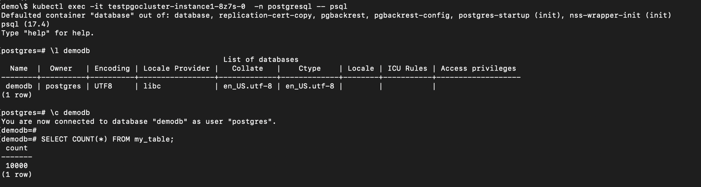

## Overview

Crunchy Postgres for Kubernetes (PGO) provides a robust Kubernetes-native operator for deploying and managing PostgreSQL clusters. In production environments, cloning PostgreSQL clusters is commonly required for development, testing, reporting, and disaster recovery use cases.

OpenEBS Replicated PV Mayastor enables fast, storage-level snapshot capabilities using copy-on-write (COW) semantics. By integrating OpenEBS VolumeSnapshots with Crunchy Postgres for Kubernetes, PostgreSQL clusters can be cloned efficiently without relying solely on traditional logical restore workflows.

Crunchy Postgres for Kubernetes integrates snapshot capture with traditional pgBackRest backup procedures. Each manual or scheduled backup operation produces a consistent snapshot. With each new snapshot, the previous snapshot is automatically deleted, eliminating the need for manual snapshot management.

This document explains how to configure OpenEBS VolumeSnapshots and clone a Crunchy Data PostgreSQL cluster using snapshot-based restoration.

## Environment

The following versions were used for this workflow:

| Component | Version |
| :--- | :--- |
| Crunchy PostgreSQL Operator | v5.7 |
| OpenEBS | v4.2.0 |
| Kubernetes | v1.29.6 |
| kubectl mayastor plugin | v2.7.4+0 |

## Prerequisites

### Setup OpenEBS

- **Install OpenEBS**
  
  Ensure that OpenEBS is installed in your cluster. Refer to the [OpenEBS Installation Documentation](../../quickstart-guide/installation.md) for step-by-step instructions.

- **Install the `kubectl-openebs` Plugin**
  
  Ensure that `kubectl-openebs` plugin is installed. Refer to the [Kubectl OpenEBS Plugin Documentation](../../user-guides/kubectl-openebs.md) to install the plugin.

- **Create a StorageClass**

1. Create a file named `StorageClass.yaml`.
  
**StorageClass.yaml**
```yaml
apiVersion: storage.k8s.io/v1
kind: StorageClass
metadata:
  name: mayastor-1
parameters:
  protocol: nvmf
  repl: "1"
  thin: "true"  # should be thin only
provisioner: io.openebs.csi-mayastor
reclaimPolicy: Delete
volumeBindingMode: WaitForFirstConsumer
allowVolumeExpansion: true
```

2. Apply the configuration.
  
```
kubectl create -f StorageClass.yaml
```

### Create a VolumeSnapshotClass

1. Create a file named `VolumeSnapshotClass.yaml`.

```yaml
apiVersion: snapshot.storage.k8s.io/v1
kind: VolumeSnapshotClass
metadata:
  name: csi-mayastor-snapshotclass
  annotations:
    snapshot.storage.kubernetes.io/is-default-class: "true"
driver: io.openebs.csi-mayastor
deletionPolicy: Delete
```

2. Apply the configuration.
  
```
kubectl create -f VolumeSnapshotClass.yaml
```

## Crunchy Postgres for Kubernetes (PGO) Setup

1. Install the Operator using Kustomize. Clone the operator examples repository:

```
git clone https://github.com/CrunchyData/postgres-operator-examples.git
cd postgres-operator-examples
```

Refer to the [Install Crunchy Postgres for Kubernetes Documentation](https://access.crunchydata.com/documentation/postgres-operator/latest/installation) for alternative installation methods.

2. Create the operator namespace.

```
kubectl apply -k kustomize/install/namespace
```

3. Edit the default kustomization file to enable VolumeSnapshots.

```
vi kustomize/install/default/kustomization.yaml
```

4. Add the following environment variable.

```yaml
env:
- name: PGO_FEATURE_GATES
  value: "VolumeSnapshots=true"
```

5. Install the operator.

```bash
kubectl apply --server-side -k kustomize/install/default
```

## Deploying a PostgreSQL Cluster

1. Create a namespace for PostgreSQL cluster.

```
kubectl create ns postgresql
```

2. Create a file named `PostgreSQL_Cluster.yaml`.

**Cluster.yaml**
```yaml
apiVersion: postgres-operator.crunchydata.com/v1beta1
kind: PostgresCluster
metadata:
  name: testpgocluster
  namespace: postgresql
spec:
  postgresVersion: 17
  instances:
    - name: instance1
      replicas: 2
      dataVolumeClaimSpec:
        storageClassName: mayastor-1
        accessModes:
        - "ReadWriteOnce"
        resources:
          requests:
            storage: 4Gi
      walVolumeClaimSpec:
        storageClassName: mayastor-1
        accessModes:
        - "ReadWriteOnce"
        resources:
          requests:
            storage: 1Gi
  backups:
    snapshots:
      volumeSnapshotClassName: csi-mayastor-snapshotclass
    pgbackrest:
      repos:
      - name: repo1
        volume:
          volumeClaimSpec:
            storageClassName: mayastor-1
            accessModes:
            - "ReadWriteOnce"
            resources:
              requests:
                storage: 4Gi
```

3. Apply the cluster configuration.

```
kubectl create -f PostgreSQL_Cluster.yaml
```

```bash
kubectl get all -n postgresql
```

**Sample Output**

```yaml hideCopy=true
NAME                                              READY         STATUS            RESTARTS      AGE
pod/testpgocluster-backup-pl45-qjpst              0/1           Completed         0             60m
pod/testpgocluster-instance1-8z7s-0               4/4           Running           0             60m
pod/testpgocluster-instance1-jkww-0               4/4           Running           0             60m
pod/testpgocluster-repo-host-0                    2/2           Running           0             60m

NAME                                              TYPE          CLUSTER-IP        EXTERNAL-IP   PORT(S)     AGE
service/testpgocluster-ha                         ClusterIP     10.99.50.188      <none>        5432/TCP    60m
service/testpgocluster-ha-config                  ClusterIP     None              <none>        <none>      60m
service/testpgocluster-pods                       ClusterIP     None              <none>        <none>      60m
service/testpgocluster-primary                    ClusterIP     None              <none>        5432/TCP    60m
service/testpgocluster-replicas                   ClusterIP     10.98.140.213     <none>        5432/TCP    60m

NAME                                              READY         AGE
statefulset.apps/testpgocluster-instance1-8z7s    1/1           60m
statefulset.apps/testpgocluster-instance1-jkww    1/1           60m
statefulset.apps/testpgocluster-repo-host         1/1           60m

NAME                                              COMPLETIONS   DURATION          AGE
job.batch/testpgocluster-backup-pl45              1/1           118s              60m
```

After deployment, a backup job runs automatically, generating a consistent snapshot.

4. Check if a volumesnapshot was created successfully.

```bash
kubectl get volumesnapshot -n postgresql
```

**Sample Output**

```yaml hideCopy=true
NAME                                   READYTOUSE   SOURCEPVC                   SOURCESNAPSHOTCONTENT                                 RESTORESIZE   SNAPSHOTCLASS                 SNAPSHOTCONTENT                                         CREATIONTIME   AGE
testpgocluster-pgdata-snapshot-c5hc    true         testpgocluster-snapshot     snapcontent-c2ed0472-d0c0-43fe-ab25-98137be9a0d0       4Gi           csi-mayastor-snapshotclass    snapcontent-c2ed0472-d0c0-43fe-ab25-98137be9a0d0       49s            63s
```

## Insert Sample Data into the PostgreSQL Cluster

1. Identify the primary pod.

```
kubectl get pods -n postgresql --selector=postgres-operator.crunchydata.com/role=master
```

2. Connect to the pod.

```
kubectl exec -it <primary-pod-name> -n postgresql -- psql
```

3. Insert sample data.

```bash
-- Create a demo database:
create database demodb;

-- List the Database:
\l demodb

-- Connect to the database:
\c demodb

-- Insert Data in demodb
-- Create a table named 'my_table' with some sample columns.
CREATE TABLE my_table (
    id SERIAL PRIMARY KEY,
    name VARCHAR(255),
    value INTEGER,
    created_at TIMESTAMP DEFAULT NOW()
);

-- Insert 100 records into the table.
INSERT INTO my_table (name, value)
SELECT
    'Record ' || generate_series(1, 100), -- Generate names like 'Record 1', 'Record 2', etc.
    (random() * 1000)::INTEGER -- Generate random integer values.
FROM generate_series(1, 100);

-- Optionally, verify the inserted records.
SELECT * FROM my_table;
SELECT COUNT(*) FROM my_table;
```
**Record Count Before Backup**


## Triggering a Manual Backup

1. Add the manual backup specification to the PostgresCluster CR.

```yaml
manual:
  repoName: repo1
  options:
  - --type=full
```

2. Trigger the backup using annotation.

```
kubectl annotate -n postgresql postgrescluster testpgocluster postgres-operator.crunchydata.com/pgbackrest-backup="$(date)"
```

For subsequent backups:

```
kubectl annotate -n postgresql postgrescluster testpgocluster --overwrite postgres-operator.crunchydata.com/pgbackrest-backup="$(date)"
```

Upon successful completion:
- A new snapshot is created
- The previous snapshot is automatically removed

3. Check if a volumesnapshot was created successfully.

```bash
kubectl get volumesnapshot -n postgresql
```

**Sample Output**

```yaml hideCopy=true
NAME                                   READYTOUSE   SOURCEPVC                   SOURCESNAPSHOTCONTENT                              RESTORESIZE   SNAPSHOTCLASS                 SNAPSHOTCONTENT                                   CREATIONTIME   AGE
testpgocluster-pgdata-snapshot-xrlv    true         testpgocluster-snapshot     snapcontent-d94fd9e7-eeca-4e9a-ac3d-13487b6cd3fe   4Gi           csi-mayastor-snapshotclass    snapcontent-d94fd9e7-eeca-4e9a-ac3d-13487b6cd3fe   37s            42s
```

## Cloning the PostgreSQL Cluster

Crunchy Postgres for Kubernetes will automatically look for the source cluster’s snapshot. If a snapshot is found, a new persistent volume will be populated with the data in the snapshot.

1. Create a file named `cluster_clone.yaml`.

```yaml
apiVersion: postgres-operator.crunchydata.com/v1beta1
kind: PostgresCluster
metadata:
  name: restoredtestpgocluster
spec:
  dataSource:
    postgresCluster:
      clusterName: testpgocluster
      repoName: repo1
  postgresVersion: 17
  instances:
    - name: instance1
      replicas: 2
      dataVolumeClaimSpec:
        storageClassName: mayastor-1
        accessModes:
        - "ReadWriteOnce"
        resources:
          requests:
            storage: 4Gi
      walVolumeClaimSpec:
        storageClassName: mayastor-1
        accessModes:
        - "ReadWriteOnce"
        resources:
          requests:
            storage: 1Gi
  backups:
    snapshots:
      volumeSnapshotClassName: csi-mayastor-snapshotclass
    pgbackrest:
      repos:
      - name: repo1
        volume:
          volumeClaimSpec:
            storageClassName: mayastor-1
            accessModes:
            - "ReadWriteOnce"
            resources:
              requests:
                storage: 4Gi
```

2. Apply the cloned cluster configuration.

```
kubectl create -f cluster_clone.yaml -n postgresql
```

The cloned cluster is created in the same namespace as the source cluster.

## Verifying Cloned Data

1. Connect to the restored PostgreSQL cluster.

```
kubectl exec -it <restored-primary-pod> -n postgresql -- psql
```

2. Verify the data.

```
\c demodb
SELECT COUNT(*) FROM my_table;
```

**Sample Output**
```yaml hideCopy=true
[demo]$ kubectl get pods -n postgresql --selector=postgres-operator.crunchydata.com/role=master
NAME                                              READY   STATUS    RESTARTS   AGE
restoredtestpgocluster-instance1-74cb-0          4/4     Running   0          105s
testpgocluster-instance1-8z7s-0                  4/4     Running   0          163m

[demo]$ kubectl exec -it restoredtestpgocluster-instance1-74cb-0 -n postgresql -- psql
Defaulted container "database" out of: database, replication-cert-copy, pgbackrest, pgbackrest-config, postgres-startup (init), nss-wrapper-init (init)
psql (17.4)
Type "help" for help.

postgres=#
postgres=#
postgres=# \c demodb
You are now connected to database "demodb" as user "postgres".

demodb=# SELECT COUNT(*) FROM my_table;
 count
-------
 10000
(1 row)
```

The record count should match the source cluster, confirming successful cloning using OpenEBS VolumeSnapshots.

## See Also

- [Replicated PV Mayastor Installation on OpenShift](../openebs-on-kubernetes-platforms/openshift.md)
- [Replicated PV Mayastor Installation on Talos](../openebs-on-kubernetes-platforms/talos.md)
- [Kasten Backup and Restore using Replicated PV Mayastor Snapshots - FileSystem](../backup-and-restore/kasten-br-fs.md)
- [Velero Backup and Restore using Replicated PV Mayastor Snapshots - FileSystem](../backup-and-restore/velero-br-fs.md)
- [KubeVirt VM Backup and Restore using Replicated PV Mayastor VolumeSnapshots and Velero - FileSystem](../backup-and-restore/kubevirt-backup.md)
- [OpenEBS VolumeSnapshots for CloudNativePG Backups](cloudnative-pg-backups.md)