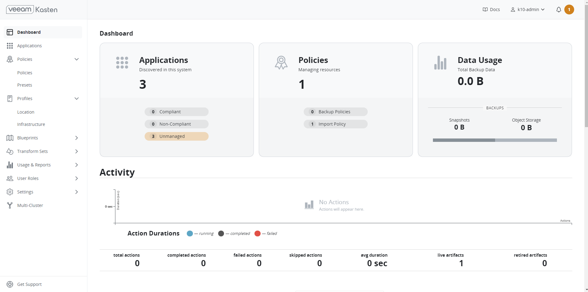

# Kasten Backup and Restore using Replicated PV Mayastor Snapshots - FileSystem

Using Kasten K10 for backup and restore operations with Replicated PV Mayastor snapshots combines the strengths of both tools, providing a robust, high-performance solution for protecting your Kubernetes applications and data. This integration ensures that your stateful applications are protected, with the flexibility to recover quickly from any failure or to migrate data as needed, ensuring your data is always protected and recoverable.

In this guide, we will utilize Kasten to create a backup of a sample Nginx application with a Replicated PV Mayastor from a cluster, transfer the backup to an object store, and restore it on a different cluster.

## Requirements

### Replicated PV Mayastor

Replicated PV Mayastor, a high-performance, container-native storage that provides persistent storage for Kubernetes applications. It supports various storage types, including local disks, NVMe, and more. It integrates with Kubernetes and provides fast, efficient snapshots and creates snapshots at the storage layer, providing a point-in-time copy of the data. These snapshots are highly efficient and consume minimal space, as they only capture changes since the last snapshot.

Make sure that Replicated PV Mayastor has been installed, pools have been configured, and applications have been deployed before proceeding to the next step. Refer to the [OpenEBS Installation Documentation](../../quickstart-guide/installation.md#installation-via-helm) for more details.

### Kasten K10

Kasten K10, a Kubernetes-native data management platform that offers backup, disaster recovery, and application mobility for Kubernetes applications. It automates and orchestrates backup and restore operations, making it easier to protect Kubernetes applications and data. Kasten K10 integrates with Replicated PV Mayastor to orchestrate the snapshot creation process. This ensures that snapshots are consistent with the application's state, making them ideal for backup and restore operations. Refer to the [Kasten Documentation](https://docs.kasten.io/latest/index.html) for more details.

## Details of Setup

### Install Kasten

Install Kasten (V7.0.5) using `helm`. Refer to the [Kasten Documentation](https://docs.kasten.io/7.0.5/install/requirements.html#prerequisites) to view the prerequisites and pre-flight checks.

As an example, we will be using `openebs-hostpath` storageclass as a global persistence storageclass for the Kasten installation. 

1. Install Kasten.

```
helm install k10 kasten/k10 --namespace=kasten-io --set global.persistence.storageClass=openebs-hostpath
```

2. Verify that Kasten has been installed correctly.

**Command**

```
kubectl get po -n kasten-io
```

**Output**

```
NAME                                    READY   STATUS    RESTARTS   AGE
aggregatedapis-svc-6cff958895-4kq8j     1/1     Running   0          4m11s
auth-svc-7f48c794f-jmw4k                1/1     Running   0          4m10s
catalog-svc-55798f8dc-m7nqm             2/2     Running   0          4m11s
controllermanager-svc-85679687f-7c5t2   1/1     Running   0          4m11s
crypto-svc-7f9bbbbccd-g4vf7             4/4     Running   0          4m11s
dashboardbff-svc-77d8b59b4d-lxtrr       2/2     Running   0          4m11s
executor-svc-598dd65578-cmvnt           1/1     Running   0          4m11s
executor-svc-598dd65578-d8jnx           1/1     Running   0          4m11s
executor-svc-598dd65578-p52h5           1/1     Running   0          4m11s
frontend-svc-7c97bf4c7d-xmtb7           1/1     Running   0          4m11s
gateway-68cdc7846-x9vw4                 1/1     Running   0          4m11s
jobs-svc-7489b594c4-zkx4n               1/1     Running   0          4m11s
k10-grafana-5fdccfbc5c-jtlms            1/1     Running   0          4m11s
kanister-svc-9f47747f5-kt4r6            1/1     Running   0          4m10s
logging-svc-6846c585d8-hqkt2            1/1     Running   0          4m11s
metering-svc-64d847f4c7-chk9s           1/1     Running   0          4m11s
prometheus-server-cbd4d5d8c-vql87       2/2     Running   0          4m11s
state-svc-84c9bcc968-n2hg4              3/3     Running   0          4m11s
```

### Create VolumeSnapshotClass

Whenever Kasten identifies volumes that were provisioned via a CSI driver, it will search for a VolumeSnapshotClass with Kasten annotation for the identified CSI driver. It will then utilize this to create snapshots.

Create a `VolumeSnapshotClass` with the following yaml:

```
apiVersion: snapshot.storage.k8s.io/v1
kind: VolumeSnapshotClass
metadata:
  annotations:
    k10.kasten.io/is-snapshot-class: "true"
  name: csi-mayastor-snapshotclass
deletionPolicy: Delete
driver: io.openebs.csi-mayastor
```

### Validate Dashboard Access

Use the following `kubectl` command to forward a local port to the Kasten ingress port or change the 'svc' type from **ClusterIP** to **NodePort** to establish a connection to it.

:::note
By default, the Kasten dashboard is not exposed externally.
:::

In this example we have changed the 'svc' type to **NodePort**:

- Forward a local port to the Kasten ingress port.

```
kubectl --namespace kasten-io port-forward service/gateway 8080:80
```

or

- Change the 'service type' type as **NodePort**.

**Command**

```
kubectl patch svc gateway -n kasten-io -p '{"spec": {"type": "NodePort"}}'
```

**Output**

```
service/gateway patched
```

**Command**

```
kubectl get svc -n kasten-io
```

**Output**

```
NAME                    TYPE        CLUSTER-IP       EXTERNAL-IP   PORT(S)                               AGE
aggregatedapis-svc      ClusterIP   10.98.172.242    <none>        443/TCP                               4m57s
auth-svc                ClusterIP   10.100.81.56     <none>        8000/TCP                              4m57s
catalog-svc             ClusterIP   10.104.93.115    <none>        8000/TCP                              4m57s
controllermanager-svc   ClusterIP   10.98.166.83     <none>        8000/TCP,18000/TCP                    4m57s
crypto-svc              ClusterIP   10.104.77.142    <none>        8000/TCP,8003/TCP,8001/TCP,8002/TCP   4m57s
dashboardbff-svc        ClusterIP   10.105.136.20    <none>        8000/TCP,8001/TCP                     4m57s
executor-svc            ClusterIP   10.100.151.70    <none>        8000/TCP                              4m57s
frontend-svc            ClusterIP   10.100.151.96    <none>        8000/TCP                              4m57s
gateway                 NodePort    10.111.123.227   <none>        80:30948/TCP                          4m57s
gateway-admin           ClusterIP   10.105.197.120   <none>        8877/TCP                              4m57s
jobs-svc                ClusterIP   10.105.46.23     <none>        8000/TCP                              4m57s
k10-grafana             ClusterIP   10.106.140.98    <none>        80/TCP                                4m57s
kanister-svc            ClusterIP   10.108.254.197   <none>        8000/TCP                              4m57s
logging-svc             ClusterIP   10.100.192.252   <none>        8000/TCP,24224/TCP,24225/TCP          4m57s
metering-svc            ClusterIP   10.111.201.5     <none>        8000/TCP                              4m57s
prometheus-server       ClusterIP   10.99.223.19     <none>        80/TCP                                4m57s
prometheus-server-exp   ClusterIP   10.109.89.22     <none>        80/TCP                                4m57s
state-svc               ClusterIP   10.99.183.141    <none>        8000/TCP,8001/TCP,8002/TCP            4m57s
```

Now, we have the dashboard accessible as below:


### Add s3 Location Profile

Location profiles help with managing backups and moving applications and their data. They allow you to create backups, transfer them between clusters or clouds, and import them into a new cluster. Click **Add New** on the profiles page to create a location profile.


The `GCP Project ID` and `GCP Service Key` fields are mandatory. The `GCP Service Key` takes the complete content of the service account JSON file when creating a new service account. As an example, we will be using Google Cloud Bucket from Google Cloud Platform (GCP). Refer to the [Kasten Documentation](https://docs.kasten.io/latest/install/storage.html) for more information on profiles for various cloud environments.

:::important
Make sure the service account has the necessary permissions.
:::

## Application Snapshot - Backup and Restore

### From Source Cluster

In this example, We have deployed a sample Nginx test application with a Replicated PV Mayastor PVC where volume mode is Filesystem.

**Application yaml**

```
apiVersion: apps/v1
kind: Deployment
metadata:
  name: test
  namespace: test
spec:
  replicas: 1  # You can increase this number if you want more replicas.
  selector:
    matchLabels:
      app: test
  template:
    metadata:
      labels:
        app: test
    spec:
      nodeSelector:
        kubernetes.io/os: linux
      containers:
        - image: nginx
          name: nginx
          command: [ "sleep", "1000000" ]
          volumeMounts:
            - name: claim
              mountPath: "/volume"
      volumes:
        - name: claim
          persistentVolumeClaim:
            claimName: mayastor-pvc
```

**PVC yaml**

```
apiVersion: v1
kind: PersistentVolumeClaim
metadata:
  name: mayastor-pvc
  namespace: test
spec:
  accessModes:
  - ReadWriteOnce
  resources:
    requests:
      storage: 1Gi
  storageClassName: mayastor-thin-multi-replica 
  volumeMode: Filesystem
```

**Command**

```
kubectl get po -n test
```

**Output**

```
NAME                   READY   STATUS    RESTARTS   AGE
test-cd9847c9c-wc6th   1/1     Running   0          25s
```

**Command**

```
kubectl get pvc -n test
```

**Output**

```
NAME           STATUS   VOLUME                                     CAPACITY   ACCESS MODES   STORAGECLASS                  AGE
mayastor-pvc   Bound    pvc-b5baa4cf-b126-42e6-b11f-3e20aeb3ab7b   1Gi        RWO            mayastor-thin-multi-replica   54s
```

**Sample Data**

```
kubectl exec -it test-cd9847c9c-wc6th -n test -- bash
root@test-cd9847c9c-wc6th:/# cd volume/
root@test-cd9847c9c-wc6th:/volume# cat abc
Mayastor Kasten backup and restore
root@test-cd9847c9c-wc6th:/volume#
```

#### Applications from Kasten Dashboard

By default, the Kasten platform equates namespaces to applications. Since we have already installed the applications, clicking the Applications card on the dashboard will take us to the following view:


#### Create Policies from Kasten Dashboard

Policies are implemented in Kasten to streamline/automate data management workflows. A section on the management of policies is located adjacent to the Applications card on the primary dashboard. To accomplish this, they integrate actions that you wish to execute (e.g., snapshots), a frequency or schedule for how often you want to take that action, and selection criteria for the resources you want to manage.

:::important
Policy can be either created from this page or from the application page. Users should “Enable backups via Snapshot exports” to export applications to s3.
:::

- Select the application. In this example, it is “test”.


- Click **Create Policy** once all necessary configurations are done.


- Click **Show import details** to get the import key. Without the import key, users are unable to import this on the target cluster. 


- When you create an import policy on the receiving cluster, you need to copy and paste the encoded text that is displayed in the **Importing Data** dialog box.


#### Backup

Once the policies have been created, it is possible to run the backup. In this scenario, we have created policies to run “on-demand”. A snapshot can be scheduled based on the available options. Example: hourly/weekly

- Select **Run Once > Yes, Continue** to trigger the snapshot. Backup operations convert application and volume snapshots into backups by transforming them into an infrastructure-independent format and then storing them in a target location (Google Cloud Bucket).


You can monitor the status of the snapshots and export them from the Dashboard. The backup had been successfully completed and exported to the storage location.

### From Target Cluster

Make sure that Replicated PV Mayastor has been installed, pools have been configured, and storageclasses are created (same as a backup cluster) before restoring the target cluster. Refer to the [OpenEBS Installation Documentation](../../quickstart-guide/installation.md#installation-via-helm) for more details.

Make sure that Kasten has been installed, volumesnapshotclass is created, and the dashboard is accessible before restoring the target cluster. Refer to the [Install Kasten section](#install-kasten) for more details.

:::note
The Location profile must be located in the exact same location as our backup, otherwise the restore would be unsuccessful. 
:::

We have completed the backup process and followed the above configurations on the restore cluster. Therefore, the dashboard is now available for the target cluster.



#### Create Import Policy

Create an import policy to restore the application from the backup. Click **Create New Policy** and enable **Restore After Import** to restore the applications once imported. If this is not enabled, you have to manually restore the applications from the import metadata available from the Dashboard. 


The policy is being developed with an on-demand import frequency. In the Import section of the configuration data paste the text that was displayed when the restore point was exported from the source cluster.


Click **Create New Policy** once all necessary configurations are done. 


#### Restore

Once the policies are created, the import and restore processes can be initiated by selecting **Run Once**.  


Restore has been successfully completed.


### Verify Application and Data

Use the following command to verify the application and the data.

**Command**

```
kubectl get pvc -n test
```

**Output**

```
NAME           STATUS   VOLUME                                     CAPACITY   ACCESS MODES   STORAGECLASS                  AGE
mayastor-pvc   Bound    pvc-dee0596a-5382-4eae-9cc2-82e79403df58   1Gi        RWO            mayastor-thin-multi-replica   33s
```

**Command**

```
kubectl get po -n test
```

**Output**

```
NAME                   READY   STATUS    RESTARTS   AGE
test-cd9847c9c-s922r   1/1     Running   0          38s
```

**Sample Data**

```
root@master-restore:~# kubectl exec -it test-cd9847c9c-s922r -n test -- bash
root@test-cd9847c9c-s922r:/# cd volume/
root@test-cd9847c9c-s922r:/volume# cat abc
Mayastor Kasten backup and restore
root@test-cd9847c9c-s922r:/volume# exit
exit
root@master-restore:~#
```

The PVC/Deployment has been restored as expected. 

## See Also

- [Velero Backup and Restore using Replicated PV Mayastor Snapshots - Raw Block Volumes](velero-br-rbv.md)
- [Replicated PV Mayastor Installation on MicroK8s](../openebs-on-kubernetes-platforms/microkubernetes.md)
- [Replicated PV Mayastor Installation on Talos](../openebs-on-kubernetes-platforms/talos.md)
- [Replicated PV Mayastor Installation on Google Kubernetes Engine](../openebs-on-kubernetes-platforms/gke.md)
- [Provisioning NFS PVCs](../read-write-many/nfspvc.md)