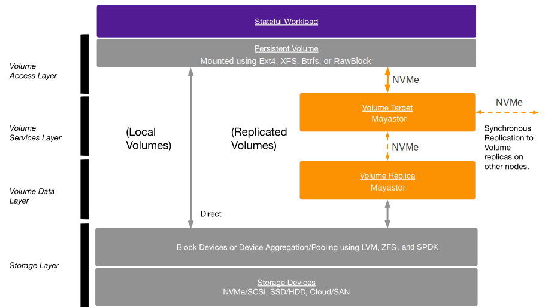

OpenEBS is the leading Open Source implementation of the [Container Native Storage (CNS)](container-native-storage.md) pattern. As a part of this approach, OpenEBS uses containers to dynamically provision volumes and provide data services like high availability. OpenEBS relies on and extends [Kubernetes](basics.md) itself to orchestrate its volume services. 

OpenEBS has many components, which can be grouped into the following two broad categories.

- [OpenEBS Data Engines](#data-engines)
- [OpenEBS Control Plane](#control-plane)

## Data Engines

The data engines are at the core of OpenEBS and are responsible for performing the read and write operations to the underlying persistent storage on behalf of the Stateful workloads they serve. 

The data engines are responsible for:
- Aggregating the capacity available in the block devices allocated to them and then carving out volumes for applications. 
- Provide standard system or network transport interfaces (NVMe) for connecting to local or remote volumes
- Provide volume services like - synchronous replication, compression, encryption, maintaining snapshots, access to the incremental or full snapshots of data and so forth
- Provide strong consistency while persisting the data to the underlying storage devices

OpenEBS follow a micro-services model to implement the data engine where the functionality is further decomposed into different layers, allowing for flexibility to interchange the layers and make data engines future-ready for changes coming in the application and data center technologies. 

The OpenEBS Data Engines comprise of the following layers:

### Volume Access Layer

Stateful workloads use standard POSIX compliant mechanisms to perform read and write operations. Depending on the type of workload, the application can prefer to perform the reads and writes either directly to the raw block device or using standard filesystems like XFS and Ext4. 

The CSI node driver or the Kubelet will take care of attaching the volume to the required node where the pod is running, formatting if necessary and mounting the filesystem to be accessible by the pod. Users have the option of setting the mount options and filesystem permissions at this layer which will be carried out by the CSI node driver or kubelet. 

The details required for attaching the volumes (using local or NVMe) and mounting (Ext4, XFS, etc) are available through the Persistent Volume Spec. 

### Volume Services Layer 

This layer is often called as the Volume Target Layer or even the Volume Controller layer as it is responsible for providing a Logical Volume. The application reads and writes are performed through the Volume Targets - which controls access to the volumes, synchronous replication of the data to other nodes in the cluster and helps in deciding which of the replica acts as master and facilitates rebuilding of data to old or restarted replicas. 

The implementation pattern used by data engines to provide high availability is what differentiates OpenEBS from other traditional storage controllers. Unlike using a single storage controller for performing the IOs on multiple volumes, OpenEBS creates one storage controller (called Target/Nexus) per volume, with a specific list of nodes where the volume data will be saved. Each node will have complete data of the volume distributed using synchronous replication. 

Using a single controller to implement synchronous replication of data to a fixed set of nodes (instead of distribution via multiple metadata controller), reduces the overhead in managing the metadata and also reduces the blast radius related to a node failure and other nodes participating in the rebuild of the failed node. 

The OpenEBS volume services layer exposes the volumes as:
- Device or Directory paths in case of Local Storage (a.k.a Local Engine)
- NVMe Target in case of Replicated Storage (a.k.a Replicated Engine)

### Volume Data Layer 

OpenEBS Data Engines create a Volume Replica on top of the storage layer. Volume Replicas are pinned to a node and are created on top of the storage layer. The replica can be any of the following:

- Sub-directory - in case the storage layer used is a filesystem directory.
- Full Device or Partitioned Device - in case the storage layer used is block devices.
- Logical Volume - in case the storage layer used is a device pool coming from Local Storage.

In case the applications require only local storage, then the persistent volume will be created using one of the above directories, device (or partition) or logical volume. OpenEBS [control plane](#control-plane) will be used to provision one of the above replicas. 

OpenEBS can add the layer of high availability on top of the locally attached storage using the Replicated Storage. In this case, OpenEBS uses a light-weight storage controller software that can receive the read/write operations over a network end-point and then be passed on to the underlying storage layer. OpenEBS then uses these Replica network endpoints to maintain a synchronous copy of the volume across nodes. 

OpenEBS Volume Replicas typically go through the following states:
- Initializing, during initial provisioning and is being registered to its volume
- Healthy, when the replica can participate in the read/write operations
- Offline, when the node or the storage where the replica has failed
- Rebuilding, when the node or storage failure has been rectified and the replica is receiving its data from other healthy replicas
- Terminating, when the volume has been deleted, the replica is being deleted and space is reclaimed

### Storage Layer 

The storage layer forms the basic building blocks for persisting the data. The storage layer comprises of block devices attached to the node (either locally via PCIe, SAS, NVMe or via remote SAN/Cloud). The storage layer could also be a sub-directory on top of a mounted filesystem. 

The storage layer is outside the purview of the OpenEBS Data Engines and is available to the Kubernetes storage constructs using standard operating system or Linux software constructs.  

The Data Engines consume the storage as a device, a device pool, or a filesystem directory. 

## Control Plane

The control plane in the context of OpenEBS refers to a set of tools or components deployed in the cluster that are responsible for:
- Managing the storage available on the Kubernetes worker nodes
- Configuring and managing the data engines
- Interfacing with CSI to manage the lifecycle of volumes 
- Interfacing with CSI and other tools carrying out operations like - snapshots, clones, resize, backup, restore, etc. 
- Integrating into other tools like Prometheus/Grafana for telemetry and monitoring 
- Integrating into other tools for debugging, troubleshooting, or log management

OpenEBS Control Plane comprises a set of micro-services that are themselves managed by Kubernetes, making OpenEBS truly Kubernetes native. The configuration managed by the OpenEBS Control Plane is saved as Kubernetes custom resources. The functionality of the control plane can be decomposed into the various stages as follows:

### Helm Chart

OpenEBS components can be installed by the administrator using a highly configurable Helm chart. OpenEBS installation is also supported via the Management Kubernetes offerings such as OpenShift, EKS, DO, and Rancher as marketplace applications or as add-ons or plugins tightly integrated into Kubernetes distributions such as MicroK8s, Kinvolk, and Kubesphere. 

As part of the OpenEBS install, the control plane components for the selected data engines will be installed as cluster and/or node components using standard Kubernetes primitives like Deployments, DaemonSets, Statefulsets, and such. The OpenEBS installation also takes care of loading the OpenEBS custom resource definitions into the Kubernetes. 

OpenEBS control plane components are all stateless. It depends on the custom resources and etcd server for managing their internal configuration state and reporting the status of the various components.

### Declarative API 

OpenEBS supports Declarative API for managing all of its operations and the APIs are exposed as Kubernetes custom resources. Kubernetes CRD validators and admission webhooks are used to validate the inputs provided by the users and to validate if the operations are allowed.  

The Declarative API is a natural extension to what Kubernetes administrators and users are accustomed to, where they can define the intent via a Helm chart and then Kubernetes and associated OpenEBS Operators will reconcile the state with the user's intent. 

The Declarative API can be used to configure the Data Engines and set up volume profiles/policies. Even upgrades of the data engines are performed using this API. The API can be used to: 
- Manage the configuration for each Data Engine
- Manage the way the storage needs to be managed or storage pools 
- Manage the volumes and its services - creation, snapshots, clones, backup, restore, and deletion
- Manage upgrades of pools and volumes

### Data Engine Operators 

All of the Data Engine operations from discovering the underlying storage to the creation of pools and volumes are packaged as Kubernetes Operators. Each of the Data Engines either operates on top of a configuration provided during the installation or is controlled via the corresponding Kubernetes custom resources. 

The Data Engine operators can either be at the cluster scope or operating on a specific node. The cluster scope operators are usually involved in operations where interactions with the Kubernetes components are involved - in orchestrating the scheduling or migration of pools and volumes on various nodes. The node level operators operate on the local operations like creating volumes, replicas, snapshots, and such on the storage or pools available on the node. 

Data Engine Operators are often also called as control plane of the Data Engines as they facilitate in managing the volumes and the data services offered by the corresponding Data Engines. Depending on the features provided or needed, some Data Engines can have multiple operators, whereas local volume operations can be embedded directly into the corresponding CSI controller/provisioner.

### CSI Driver (Dynamic Volume Provisioner) 

CSI Drivers act as the facilitators for managing the life-cycle of volumes within Kubernetes. The CSI Driver operations are controlled or customized by the parameters specified in `StorageClass`. The CSI drivers comprise of three layers:
- Kubernetes or Orchestrator functionality - that is native to Kubernetes and binds the application to the volumes 
- Kubernetes CSI layer - that translates the Kubernetes native calls into CSI calls - passing the information provided by users in a standard way to the CSI Drivers 
- Storage Drivers - which are CSI compliant and work very closely with the Kubernetes CSI layer to receive the requests and process them. 

The Storage Drivers are responsible for:
- Exposing the capabilities of the Data Engines
- Either directly interacting with the Data Engine or the Data Engine Operators to perform volume creation and deletion operations
- Interface with the Data Engines to attach/detach the volumes to the nodes where containers consuming the volumes are running
- Interface with standard Linux utilities to format, mount/unmount the volumes to the containers

### Plugins

OpenEBS focuses on storage operations and provides plugins for other popular tools for performing the operations that fall outside of the core storage functionality but are very important for running OpenEBS in production. Examples of such operations are:
- Application Consistent Backup and Recovery (provided via integrations into Velero) 
- Monitoring and Alerting (provided via integrations into Prometheus, Grafana, and Alert Manager) 
- Enforcing Security Policies (provided via integrations with PodSecurityPolicies or Kyerno) 
- Logging (provide via integration to any standard Logging stack setup by administrators like ELK, Loki, and Logstash) 
- Visualizations (provided via standard Kubernetes Dashboards or custom Grafana dashboards)

### CLI 

All the management functions on OpenEBS can be carried out via `kubectl` as OpenEBS uses Custom Resources for managing all of its configurations and reporting the status of the components. 

In addition, OpenEBS also has released an alpha version `kubectl plugin` to help with providing information about the pools and volumes using a single command that aggregates the information obtained via multiple `kubectl` commands.

## Dynamic Persistent Volume Provisioning

The Kubernetes CSI (provisioning layer) will intercept the requests for the Persistent Volumes and forward the requests to the OpenEBS Control Plane components to service the requests. The information provided in the StorageClass combined with requests from PVCs will determine the right OpenEBS control component to receive the request. 

OpenEBS control plane will then process the request and create the Persistent Volumes using the specified Local or Replicated Storage. The data engine services like target and replica are deployed as Kubernetes applications as well. The containers provide storage for the containers. The new containers launched for serving the applications will be available in the `openebs` namespace. 

With the magic of OpenEBS and Kubernetes, the volumes should be provisioned, pods scheduled and application ready to serve. For this magic to happen, the prerequisites should be met.

Check out our [troubleshooting section](../troubleshooting/) for some of the common errors that users run into due to setup issues.

 ## See Also

- [Data Engines](../concepts/data-engines/data-engines.md)
- [OpenEBS Local Storage](../concepts/data-engines/local-storage.md)
- [OpenEBS Replicated Storage](../concepts/data-engines/replicated-storage.md)
