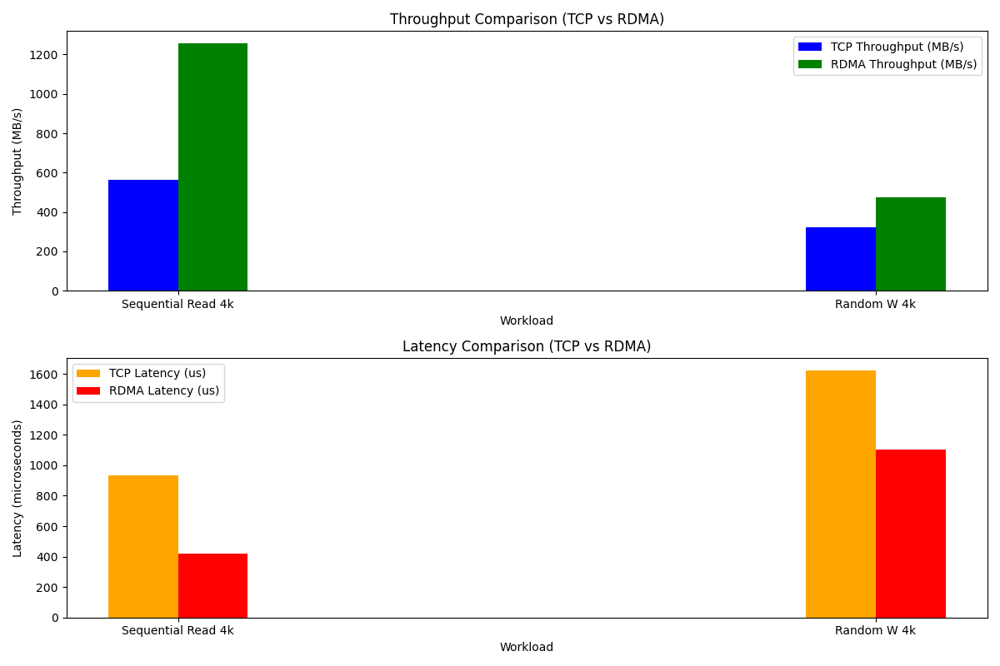

# Enable RDMA for Volume Targets

The RDMA feature in Replicated PV Mayastor enables you to achieve better throughput and latency outcomes for the applications using Replicated PV Mayastor Volumes. This feature provides a significant performance boost by leveraging RDMA technology. A Kubernetes cluster consisting of nodes that have RNIC (RDMA Network Interface Card) can make use of this feature.

## Prerequisites

Before enabling and using RDMA in Replicated PV Mayastor, ensure the following prerequisites are met:

1. **Interface Validation**

  Ensure that the interface name specified in `io-engine.target.nvmf.iface` exists on all io-engine nodes. Misconfiguration of this parameter can lead to unexpected behavior.
  If the interface name is not RDMA-capable on a node, Replicated PV Mayastor volume targets on such nodes will support only TCP connections.

2. **Application Node Requirements**

  Application nodes must also be RDMA-capable to connect to RDMA-enabled volume targets. This capability is independent of the Helm-provided interface name for `io-engine.target.nvmf.iface`. RDMA connections will work as long as the application node has an RDMA-capable device.

3. **TCP Fallback Behavior**

  If an application is hosted on a non-RDMA-capable node, connections to RDMA-enabled volume targets will default to TCP. The TCP fallback behaviour can be disabled by setting the Helm chart value `csi.node.nvme.tcpFallback` to `false`. In this configuration, the initiator (application) node will continuously attempt RDMA connections, resulting in connection failures. To mitigate this, you can either keep the fallback option enabled or relocate the application pod to an RDMA-capable node, provided the pod's resource type allows for such movement.

4. **Soft-RoCEv2 Support**

  Replicated PV Mayastor also supports software RDMA (Soft-RoCEv2) for nodes that do not have RDMA-capable hardware network interface cards. RDMA devices can be manually created using `ibverbs` utilities. For example, to create an RDMA device named `rxe0` on an Ethernet interface `eth0`, run:

  ```
  rdma link add rxe0 type rxe netdev eth0
  ```

  Once created, `rxe0` can be utilized as outlined in the Enablement section.
  
  :::note
  The IP address assignments to RDMA GIDs on these devices depends on the cluster's networking and CNI configurations. Variations in Soft-RoCEv2 device gid IP assignments are not fully known and have not been extensively tested.
  :::

## Enable RDMA

To enable the RDMA feature via Helm:

1. Set `io-engine.target.nvmf.rdma.enabled` to `true`.

2. Set `io-engine.target.nvmf.iface` to a valid network interface name that exists on an RNIC.

3. Verify that all nodes are properly configured with RDMA-capable hardware and that network interfaces are correctly identified and accessible.

:::info
Once enabled, all Replicated PV Mayastor volumes will connect over RDMA.
:::

## Performance Results

### Setup Details

- Single-replica volume

- Application, volume target, and replica located on the same node

- Application connects to the volume target using NVMe-oF

The table below compares performance metrics for RDMA and TCP under specific workloads:

<table>
 <tr> 
 <th>Workload</th>
 <th>TCP Throughput</th>
 <th>RDMA Throughput</th>
 <th>TCP Latency</th>
 <th>RDMA Latency</th>
 </tr>
  <tr>
      <td>Sequential Read 4k</td>
      <td>563 MB/s</td>
      <td>1256 MB/s</td>
      <td>931.1 us</td>
      <td>416.9 us</td>
   </tr>
  <tr>
      <td>Random Write 4k</td>
      <td>323 MB/s</td>
      <td>474 MB/s</td>
      <td>1624.4 us</td>
      <td>1105.4 us</td>
   </tr>
</table>



## See Also

- [Installation](../../../quickstart-guide/installation.md)
- [Create DiskPool(s)](../configuration/rs-create-diskpool.md)
- [Create StorageClass(s)](../configuration/rs-create-storageclass.md)
- [Storage Class Parameters](../configuration/rs-storage-class-parameters.md)
- [Topology Parameters](../configuration/rs-topology-parameters.md)
- [Deploy an Application](../configuration/rs-deployment.md)