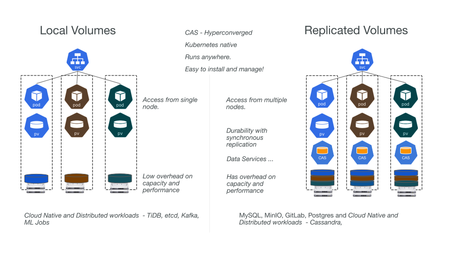

## What is OpenEBS?

OpenEBS turns any storage available to Kubernetes worker nodes into Local or Distributed Kubernetes Persistent Volumes. OpenEBS helps Application and Platform teams easily deploy Kubernetes Stateful Workloads that require fast and highly durable, reliable and scalable [Container Attached Storage](/docs/concepts/cas).

OpenEBS is also a leading choice for NVMe based storage deployments.

OpenEBS was originally built by [MayaData](https://mayadata.io) and donated to the _Cloud Native Computing Foundation_ and is now a [CNCF sandbox project](https://www.cncf.io/sandbox-projects/).

## Why do users prefer OpenEBS?

The [OpenEBS Adoption stories](https://github.com/openebs/openebs/blob/master/ADOPTERS.md), mention the top reasons driving users towards OpenEBS as:

- OpenEBS provides consistency across all Kubernetes distributions - On-premise and Cloud.
- OpenEBS with Kubernetes increases Developer and Platform SRE Productivity.
- OpenEBS is Easy to use compared to other solutions, for eg trivial to install & enabling entirely dynamic provisioning.
- OpenEBS has Excellent Community Support.
- OpenEBS is completely Open Source and Free.

## What does OpenEBS do?

OpenEBS manages the storage available on each of the Kubernetes nodes and uses that storage to provide [Local](#local-volumes) or [Distributed(aka Replicated)](#replicated-volumes) Persistent Volumes to Stateful workloads.

In case of [Local Volumes](#local-volumes):

- OpenEBS can create Persistent Volumes using raw block devices or partitions, or using sub-directories on Hostpaths or by using LVM,ZFS, or sparse files.
- The local volumes are directly mounted into the Stateful Pod, without any added overhead from OpenEBS in the data path, decreasing latency.
- OpenEBS provides additional tooling for Local Volumes for monitoring, backup/restore, disaster recovery, snapshots when backed by ZFS or LVM, capacity based scheduling, and more.

In case of [Distributed (aka Replicated) Volumes](#replicated-volumes):

- OpenEBS creates a Micro-service for each Distributed Persistent volume using one of its engines - Mayastor, cStor or Jiva.
- The Stateful Pod writes the data to the OpenEBS engines that synchronously replicate the data to multiple nodes in the cluster. The OpenEBS engine itself is deployed as a pod and orchestrated by Kubernetes. When the node running the Stateful pod fails, the pod will be rescheduled to another node in the cluster and OpenEBS provides access to the data using the available data copies on other nodes.
- The Stateful Pods connect to the OpenEBS Distributed Persistent volume using iSCSI (cStor and Jiva) or NVMeoF (Mayastor).
- OpenEBS cStor and Jiva focus on ease of use and durability of the storage. These engines use customized versions of ZFS and Longhorn technology respectively for writing the data onto the storage. 
- OpenEBS Mayastor is the latest engine and has been developed with durability and performance as design goals; OpenEBS Mayastor efficiently manages the compute (hugepages, cores) and storage (NVMe Drives) to provide fast distributed block storage.

:::tip NOTE
OpenEBS contributors prefers to call the Distributed Block Storage volumes as **Replicated Volumes**, to avoid confusion with traditional distributed block storage for the following reasons:
* Distributed block storage tends to shard the data blocks of a volume across many nodes in the cluster. Replicated volumes persist all the data blocks of a volume on a node and for durability replicate the entire data to other nodes in the cluster.  
* While accessing a volume data, distributed block storage depends on metadata hashing algorithms to locate the node where the block resides, whereas replicated volumes can access the data from any of the nodes where data is persisted (aka replica nodes).
* Replicated volumes have a lower blast radius compared to traditional distributed block storage. 
* Replicated volumes are designed for Cloud Native stateful workloads that require a large number of volumes with capacity that can typically be served from a single node as apposed to a single large volume with data sharded across multiple nodes in the cluster.
:::

OpenEBS Data Engines and Control Plane are implemented as micro-services, deployed as containers and orchestrated by Kubernetes itself. Importantly, OpenEBS data engines are implemented in user space, allowing OpenEBS to run on any Kubernetes Platform and to use any type of storage available to Kubernetes worker nodes. An added advantage of being a completely Kubernetes native solution is that administrators and developers can interact and manage OpenEBS using all the wonderful tooling that is available for Kubernetes like kubectl, Helm, Prometheus, Grafana, etc.

## Local Volumes

Local Volumes are accessible only from a single node in the cluster. Pods using Local Volume have to be scheduled on the node where volume is provisioned. Local Volumes are typically preferred for distributed workloads like Cassandra, MongoDB, Elastic, etc that are distributed in nature and have high availability built into them.

Depending on the type of storage attached to your Kubernetes worker nodes and the requirements of your workloads, you can select from different flavors of Dynamic Local PV - Hostpath, Device, LVM, ZFS or Rawfile.

### Quickstart Guides

Installing OpenEBS in your cluster is as simple as running a few `kubectl` or `helm` commands. Here are the list of our Quickstart guides with detailed instructions for each storage engine.

- [Local PV hostpath](/docs/user-guides/localpv-hostpath)
- [Local PV device](/docs/user-guides/localpv-device)
- [ZFS Local PV](https://github.com/openebs/zfs-localpv)
- [LVM Local PV](https://github.com/openebs/lvm-localpv)
- [Rawfile Local PV](https://github.com/openebs/rawfile-localpv)

## Replicated Volumes

Replicated Volumes, as the name suggests, are those that have their data synchronously replicated to multiple nodes. Volumes can sustain node failures. The replication also can be setup across availability zones helping applications move across availability zones.

Replicated Volumes also are capable of enterprise storage features like snapshots, clone, volume expansion and so forth. Replicated Volumes are a preferred choice for Stateful workloads like Percona/MySQL, Jira, GitLab, etc.

Depending on the type of storage attached to your Kubernetes worker nodes and application performance requirements, you can select from Jiva, cStor or Mayastor.

### Quickstart Guides

Installing OpenEBS in your cluster is as simple as running a few `kubectl` or `helm` commands. Here are the list of our Quickstart guides with detailed instructions for each storage engine.

- [Mayastor](/docs/user-guides/mayastor)
- [cStor](https://github.com/openebs/cstor-operators/blob/master/docs/quick.md)
- [Jiva](https://github.com/openebs/jiva-operator)

## Community Support via Slack

OpenEBS has a vibrant community that can help you get started. If you have further question and want to learn more about OpenEBS, please join [OpenEBS community on Kubernetes Slack](https://kubernetes.slack.com). If you are already signed up, head to our discussions at[#openebs](https://kubernetes.slack.com/messages/openebs/) channel.

## See Also:

- [Quickstart](/docs/user-guides/quickstart) 
- [Use cases and Examples](/docs/introduction/usecases)
- [Container Attached Storage (CAS)](/docs/concepts/cas)
- [OpenEBS Architecture](/docs/concepts/architecture)
- [OpenEBS Local PV](/docs/concepts/localpv)
- [OpenEBS Mayastor](/docs/concepts/mayastor)
