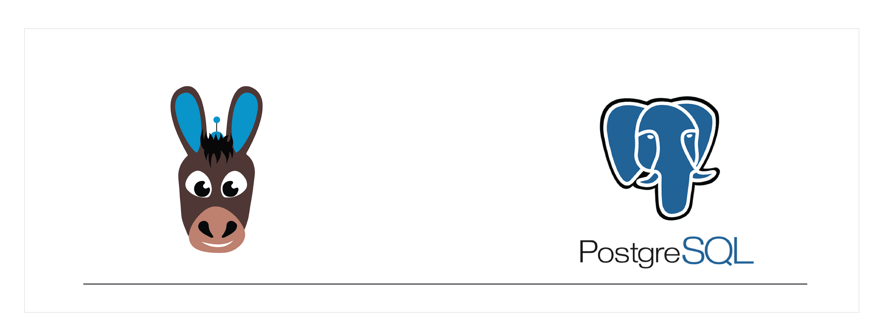
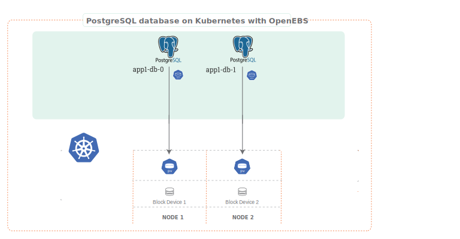

## Introduction

PostgreSQL is a powerful, open source object-relational database system. It supports a large part of the SQL standard and offers many modern features to ensure the reliability, data integrity, and correctness. This makes it very easy to manage and use by any person with a little knowledge in databases. 

StackGres is a full stack PostgreSQL distribution for Kubernetes, packed into an easy deployment unit. The StackGres stack consists of connection pooling, automatic failover and HA, monitoring, backups and DR, centralized logging, and many more. This stack is made with the help of Kubernetes operator and makes the easy way of packaging, deploying and managing PostgreSQL applications in Kubernetes ecosystem. A StackGres cluster is basically a StatefulSet where each pod is a database instance. The StatefulSet guarantees that each pod is always bound to its own persistent volume therefore the database instance data will be mapped to the state of a patroni instance inside kubernetes

This guide explains the basic installation for StackGres PostgreSQL on OpenEBS Local PV device. It also contains the creation of a sample database, tables and tuples. StackGres PostgreSQL is a StatefulSet type and the high performance of OpenEBS Local PV storage engine will be suitable for a persistent storage solution for PostgreSQL databases which can deal with heavy load. 

## Deployment model

[](../assets/StackGres-Postgres-LocalPV.svg)

We will use GKE, where we will install Stackgres PostgreSQL with OpenEBS storage engine. The Local PV volume will be provisioned on a node where Stackgres PostgreSQL pod is getting scheduled and uses one of the matching unclaimed block devices, which will then use the entire block device for storing data. No other application can use this device. If users have limited blockdevices attached to some nodes, they can use `nodeSelector` in the application YAML to provision applications on particular nodes where the available block device is present. The recommended configuration is to have at least three nodes and one unclaimed external disk to be attached per node. 

## Configuration workflow

1. [Install OpenEBS](#install-openebs)
2. [Select OpenEBS storage engine](#select-openebs-storage-engine)
3. [Configure OpenEBS Local PV StorageClass](#configure-openebs-local-pv-storageclass)
4. [Installing StackGres PostgreSQL Operator](#installing-stackgres-postgresql-operator)
5. [Installing PostgreSQL Database](#installing-postgresql-database)
6. [Accessing PostgreSQL database](#accessing-postgresql-database)

### Install OpenEBS

If OpenEBS is not installed in your K8s cluster, this can be done from [here](/docs/user-guides/installation). If OpenEBS is already installed, go to the next step.

### Select OpenEBS storage engine

A storage engine is the data plane component of the IO path of a Persistent Volume. In CAS architecture, users can choose different data planes for different application workloads based on a configuration policy. OpenEBS provides different types of storage engines and chooses the right engine that suits your type of application requirements and storage available on your Kubernetes nodes. More information can be read from [here](/).

In this document, we are deploying StackGres PostgreSQL using OpenEBS Local PV device.

### Configure OpenEBS Local PV StorageClass

There are 2 ways to use OpenEBS Local PV.

- `openebs-hostpath` - Using this option, it will create Kubernetes Persistent Volumes that will store the data into OS host path directory at: /var/openebs/<"postgresql-pv-name">/. Select this option, if you don’t have any additional block devices attached to Kubernetes nodes. You would like to customize the directory where data will be saved, create a new OpenEBS Local PV storage class using these [instructions](/docs/user-guides/localpv-hostpath#create-storageclass).

- `openebs-device` - Using this option, it will create Kubernetes Local PVs using the block devices attached to the node. Select this option when you want to dedicate a complete block device on a node to a StackGres PostgreSQL application pod. You can customize which devices will be discovered and managed by OpenEBS using the instructions [here](/docs/user-guides/localpv-device#optional-block-device-tagging).

The Storage Class `openebs-device` has been chosen to deploy StackGres PostgreSQL in the Kubernetes cluster.

**Note:** Ensure that you have a disk with the required capacity is added to the corresponding nodes. In this example, we have added 100G disks to each node.

### Installing StackGres PostgreSQL Operator

In this section, we will install the StackGres operator. We will later deploy the latest available version of PostgreSQL application using StackGres.

```
$ kubectl apply -f https://stackgres.io/downloads/stackgres-k8s/stackgres/1.0.0/stackgres-operator-demo.yml
```

Once it’s ready, you will see that the two pods are `Running` and the other pods are in `Completed` state.

```
$ kubectl get pod -n stackgres

NAME                                           READY   STATUS      RESTARTS   AGE
stackgres-operator-78d57d4f55-node1            1/1     Running     0          3m29s
stackgres-operator-bootstrap-9p9zs             0/1     Completed   0          3m58s
stackgres-operator-conversion-webhooks-node2   0/1     Completed   0          4m
stackgres-operator-crd-upgrade-5fx7c           0/1     Completed   0          3m59s
stackgres-operator-create-certificate-r75cn    0/1     Completed   0          3m58s
stackgres-operator-upgrade-wn79r               0/1     Completed   0          3m57s
stackgres-operator-wait-mv6ss                  0/1     Completed   0          3m56s
stackgres-restapi-58c7db8b89-j8xkz             2/2     Running     0          3m22s
```

Users can manage the StackGres PostgreSQL database using a web console. This can be done accessing the Rest API service. Get the StackGres PostgreSQL service using the following command.

```
$ kubectl get svc -n stackgres

NAME                 TYPE           CLUSTER-IP    EXTERNAL-IP      PORT(S)         AGE
stackgres-operator   ClusterIP      10.8.10.219   <none>           443/TCP         4m26s
stackgres-restapi    LoadBalancer   10.8.12.173   35.225.210.254   443:30098/TCP   4m25s
```

Now, manage the PostgreSQL cluster using the Load Balancer IP on your web browser.

In this example following is the web address.

https://35.225.210.254/

Default username is **admin**

Passwords can be obtained by running the following command.

```
$ kubectl get secret -n stackgres stackgres-restapi --template '{{ printf "password = %s\n" (.data.clearPassword | base64decode) }}'

password = AYzpZCPhSJvhEEazHCmMfamtEzL9NFsAOcZQwy06
```

### Installing PostgreSQL Database

To create your first StackGres cluster you have to create a simple custom resource that reflects the cluster configuration. The following configuration file has been saved as *stackgres.yaml*.

```
apiVersion: stackgres.io/v1
kind: SGCluster
metadata:
  name: app1-db
spec:
  postgres:
    version: 'latest'
  instances: 2
  pods:
    persistentVolume:
      size: '90Gi'
      storageClass: 'openebs-device'
  prometheusAutobind: false
```

In the above PostgreSQL cluster configuration file, the Storage Class used is **openebs-device** with a capacity of **90Gi**. So while scheduling Postgres pod, NDM will assign a matched block device which matches as per the requested capacity.

Install StackGres PostgreSQL application using the following way.

```
$ kubectl apply -f stackgres.yaml

sgcluster.stackgres.io/app1-db-sc created
```

Verify the PostgreSQL cluster creation is successfully running under the default namespace.

```
$ kubectl get pod -l cluster=true

NAME        READY   STATUS    RESTARTS   AGE
app1-db-0   6/6     Running   0          2m19s
app1-db-1   6/6     Running   0          66s
```

Verify the PostgreSQL persistent volume details.

PVC:

```
$ kubectl get pvc -l cluster=true

NAME                     STATUS   VOLUME                                     CAPACITY   ACCESS MODES   STORAGECLASS     AGE
app1-db-data-app1-db-0   Bound    pvc-259d26b7-75f5-4b8f-8571-b7fda80cd2ab   90Gi       RWO            openebs-device   94s
app1-db-data-app1-db-1   Bound    pvc-5f4d965b-3dfe-477a-a48d-ed3f4ab6743d   90Gi       RWO            openebs-device   21s
```

PV:

```
$ kubectl get pv

NAME                                       CAPACITY   ACCESS MODES   RECLAIM POLICY   STATUS   CLAIM                            STORAGECLASS     REASON   AGE
pvc-259d26b7-75f5-4b8f-8571-b7fda80cd2ab   90Gi       RWO            Delete           Bound    default/app1-db-data-app1-db-0   openebs-device            108s
pvc-5f4d965b-3dfe-477a-a48d-ed3f4ab6743d   90Gi       RWO            Delete           Bound    default/app1-db-data-app1-db-1   openebs-device            35s
```

Verify PostgreSQL service status.

```
$ kubectl get services -l cluster=true

NAME               TYPE        CLUSTER-IP     EXTERNAL-IP   PORT(S)             AGE
app1-db            ClusterIP   10.3.248.225   <none>        5432/TCP,5433/TCP   8m59s
app1-db-replicas   ClusterIP   10.3.247.248   <none>        5432/TCP,5433/TCP   8m59s
```

Since we have mentioned 2 replicas and capacity with 90G in Postgres cluster spec, any two disks  with capacity more than 90G from the scheduled node will be claimed. In this case, 100G disks are present in all the nodes in the cluster. Verify whether 100G disks are claimed for provisioning PostgreSQL clusters. 

```
$ kubectl get bd -n openebs

NAME                                           NODENAME                                     SIZE           CLAIMSTATE   STATUS   AGE
blockdevice-1fcc50ef4b3550ada3f82fe90102daca   gke-user-doc-default-pool-41db3a16-t4d0      107373116928   Claimed      Active   17m
blockdevice-58c88ac19e09084c6f71178130c20ba8   gke-user-doc-default-pool-41db3a16-1122      107373116928   Unclaimed    Active   19m
blockdevice-8fd1127f57cf19b01e4da75110ae488a   gke-user-doc-default-pool-41db3a16-81tl      107373116928   Claimed      Active   19m
```

Verify the master and replicas configuration.

```
$ kubectl exec -ti "$(kubectl get pod --selector app=StackGresCluster,cluster=true -o name | head -n 1)" -c patroni -- patronictl list

+ Cluster: app1-db (7020339627461501083) --------+----+-----------+
| Member    | Host           | Role    | State   | TL | Lag in MB |
+-----------+----------------+---------+---------+----+-----------+
| app1-db-0 | 10.0.0.7:7433  | Leader  | running |  1 |           |
| app1-db-1 | 10.0.1.14:7433 | Replica | running |  1 |         0 |
+-----------+----------------+---------+---------+----+-----------+
```

Out of all of the PostgreSQL servers, one will be elected as the master, the rest will remain as read-only replicas.

### Accessing PostgreSQL database

Get the details of PostgreSQL database service.

```
$ kubectl get services -l cluster=true

NAME               TYPE        CLUSTER-IP     EXTERNAL-IP   PORT(S)             AGE
app1-db            ClusterIP   10.3.248.225   <none>        5432/TCP,5433/TCP   13m
app1-db-replicas   ClusterIP   10.3.247.248   <none>        5432/TCP,5433/TCP   13m
```

Install *postgresql-client* on your master node or a node from where you have access to the Kubernetes cluster.

```
$ sudo apt-get install postgresql-client
```

Let’s access the database by accessing one of the application pods.

```
$ kubectl exec -ti "$(kubectl get pod --selector app=StackGresCluster,cluster=true,role=master -o name)" -c postgres-util -- psql

psql (14.0 OnGres Inc.)
Type "help" for help.

postgres=# select current_user;
 current_user
--------------
 postgres
(1 row)

postgres=# CREATE USER app WITH PASSWORD 'test';

# CREATE ROLE
postgres=# CREATE DATABASE app WITH OWNER app;

#CREATE DATABASE
postgres=# \l
                              List of databases
   Name    |  Owner   | Encoding | Collate |  Ctype  |   Access privileges
-----------+----------+----------+---------+---------+-----------------------
 app       | app      | UTF8     | C.UTF-8 | C.UTF-8 |
 postgres  | postgres | UTF8     | C.UTF-8 | C.UTF-8 |
 template0 | postgres | UTF8     | C.UTF-8 | C.UTF-8 | =c/postgres          +
           |          |          |         |         | postgres=CTc/postgres
 template1 | postgres | UTF8     | C.UTF-8 | C.UTF-8 | =c/postgres          +
           |          |          |         |         | postgres=CTc/postgres
(4 rows)

$ postgres=# \c app;
You are now connected to database "app" as user "postgres".
app=#

$ CREATE TABLE COMPANY(
   ID INT PRIMARY KEY     NOT NULL,
   NAME           TEXT    NOT NULL,
   AGE            INT     NOT NULL,
   ADDRESS        CHAR(50),
   SALARY         REAL,
   JOIN_DATE	  DATE
);
CREATE TABLE

app=# INSERT INTO COMPANY (ID,NAME,AGE,ADDRESS,SALARY,JOIN_DATE) VALUES (1, 'Paul', 32, 'California', 20000.00,'2001-07-13'), (2, 'Allen', 25, 'Texas', '20000.00','2007-12-13'),(3, 'Teddy', 23, 'Norway', 20000.00, DEFAULT );

app=# \d
          List of relations
 Schema |  Name   | Type  |  Owner
--------+---------+-------+----------
 public | company | table | postgres
(1 row)

app=# select * from public.company;
 id | name  | age |                      address                       | salary | join_date
----+-------+-----+----------------------------------------------------+--------+------------
  1 | Paul  |  32 | California                                         |  20000 | 2001-07-13
  2 | Allen |  25 | Texas                                              |  20000 | 2007-12-13
  3 | Teddy |  23 | Norway                                             |  20000 |
(3 rows)

app-# \q
```

## See Also:

[OpenEBS use cases](/docs/introduction/usecases) [Understanding NDM](/docs/user-guides/ndm) [Local PV concepts](/docs/concepts/localpv) [Local PV User guide](/docs/user-guides/localpv-device)