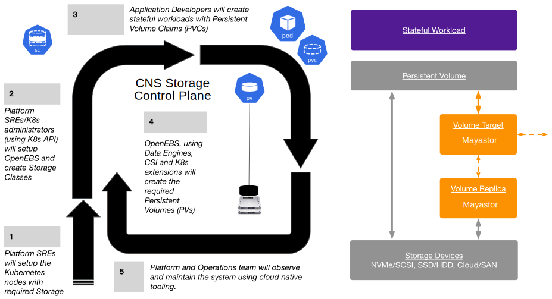

This guide will help you to set up, customize, and install OpenEBS and use OpenEBS Volumes to run your Kubernetes Stateful Workloads. If you are new to running Stateful workloads in Kubernetes, you will need to familiarize yourself with [Kubernetes Storage Concepts](../concepts/basics.md).

## How to set up and use OpenEBS?

OpenEBS seamlessly integrates into the overall workflow tooling that Kubernetes administrators and users have around Kubernetes. 

The OpenEBS workflow fits nicely into the reconciliation pattern introduced by Kubernetes, paving the way for a Declarative Storage Control Plane as shown below: 



## Prerequisites

If this is your first time installing OpenEBS Local Storage (a.k.a Local Engines), make sure that your Kubernetes nodes meet the required prerequisites for the following local storages:
- [Local PV Hostpath](../user-guides/local-storage-user-guide/local-pv-hostpath/hostpath-installation.md#prerequisites)
- [Local PV LVM](../user-guides/local-storage-user-guide/local-pv-lvm/lvm-installation.md#prerequisites)
- [Local PV ZFS](../user-guides/local-storage-user-guide/local-pv-zfs/zfs-installation.md#prerequisites)

For OpenEBS Replicated Storage (a.k.a Replicated Engine), make sure that your Kubernetes nodes meet the [required prerequisites](../user-guides/replicated-storage-user-guide/replicated-pv-mayastor/rs-installation.md#prerequisites).

At a high-level, OpenEBS requires:

- Verify that you have the admin context. If you do not have admin permissions to your cluster, check with your Kubernetes cluster administrator to help with installing OpenEBS or if you are the owner of the cluster, check out the [steps to create a new admin context](../troubleshooting/troubleshooting-local-storage.md#set-cluster-admin-user-context) and use it for installing OpenEBS.
- Each storage engine may have a few additional requirements as follows:
  - Depending on the managed Kubernetes platform like Rancher or MicroK8s - set up the right bind mounts.
  - Decide which of the devices on the nodes should be used by OpenEBS or if you need to create LVM Volume Groups or ZFS Pools.

## Supported Versions

- Kubernetes 1.23 or higher is required
- Linux Kernel 5.15 or higher is required
-	OS: Ubuntu and RHEL 8.8
-	LVM Version: LVM 2
-	ZFS Version: ZFS 0.8

## Installation via Helm

:::warning
The Helm chart registry at "https://openebs.github.io/charts" has now been deprecated as those charts are used to install legacy OpenEBS (v3.10 and below) releases. This registry will be migrated to a different registry location "https://openebs-archive.github.io/charts" by Oct 30, 2024.

The Helm charts for the latest OpenEBS (v4.0 and above) are hosted in a new registry location "https://openebs.github.io/openebs". To ensure seamless access to OpenEBS Helm charts, update your configurations to use the new registry URL.
:::

Verify helm is installed and helm repo is updated. You need helm 3.2 or more. 

1. Setup helm repository.

```
helm repo add openebs https://openebs.github.io/openebs
helm repo update
```

:::important
`helm repo add openebs https://openebs.github.io/charts` has changed to `helm repo add openebs https://openebs.github.io/openebs`.
:::

OpenEBS provides several options to customize during installation such as:
- Specifying the directory where hostpath volume data is stored or
- Specifying the nodes on which OpenEBS components should be deployed and so forth. 

2. Install the OpenEBS helm chart with default values. 

```
helm install openebs --namespace openebs openebs/openebs --create-namespace
```

The above commands will install OpenEBS Local PV Hostpath, OpenEBS Local PV LVM, OpenEBS Local PV ZFS, and OpenEBS Replicated Storage components in `openebs` namespace and chart name as `openebs`.

:::note
The default OpenEBS helm chart will install both Local Storage and Replicated Storage. If you do not want to install OpenEBS Replicated Storage, use the following command:

```
helm install openebs --namespace openebs openebs/openebs --set engines.replicated.mayastor.enabled=false --create-namespace
```
:::

3. To view the chart and get the output, use the following commands:

**Command**

```
helm ls -n openebs
```

**Output**

```
NAME     NAMESPACE   REVISION  UPDATED                                   STATUS     CHART           APP VERSION
openebs  openebs     1         2024-03-25 09:13:00.903321318 +0000 UTC   deployed   openebs-4.1.0   4.1.0
```

As a next step [verify](#verifying-openebs-installation) your installation and do the [post installation](#post-installation-considerations) steps.

## Verifying OpenEBS Installation

### Verify Pods 

#### Default Installation

List the pods in `<openebs>` namespace 

```
  kubectl get pods -n openebs
```

In the successful installation of OpenEBS, you should see an example output like below:

```
NAME                                              READY   STATUS    RESTARTS   AGE
openebs-agent-core-674f784df5-7szbm               2/2     Running   0          11m
openebs-agent-ha-node-nnkmv                       1/1     Running   0          11m
openebs-agent-ha-node-pvcrr                       1/1     Running   0          11m
openebs-agent-ha-node-rqkkk                       1/1     Running   0          11m
openebs-api-rest-79556897c8-b824j                 1/1     Running   0          11m
openebs-csi-controller-b5c47d49-5t5zd             6/6     Running   0          11m
openebs-csi-node-flq49                            2/2     Running   0          11m
openebs-csi-node-k8d7h                            2/2     Running   0          11m
openebs-csi-node-v7jfh                            2/2     Running   0          11m
openebs-etcd-0                                    1/1     Running   0          11m
openebs-etcd-1                                    1/1     Running   0          11m
openebs-etcd-2                                    1/1     Running   0          11m
openebs-io-engine-7t6tf                           2/2     Running   0          11m
openebs-io-engine-9df6r                           2/2     Running   0          11m
openebs-io-engine-rqph4                           2/2     Running   0          11m
openebs-localpv-provisioner-6ddf7c7978-4fkvs      1/1     Running   0          11m
openebs-loki-0                                    1/1     Running   0          11m
openebs-lvm-localpv-controller-7b6d6b4665-fk78q   5/5     Running   0          11m
openebs-lvm-localpv-node-mcch4                    2/2     Running   0          11m
openebs-lvm-localpv-node-pdt88                    2/2     Running   0          11m
openebs-lvm-localpv-node-r9jn2                    2/2     Running   0          11m
openebs-nats-0                                    3/3     Running   0          11m
openebs-nats-1                                    3/3     Running   0          11m
openebs-nats-2                                    3/3     Running   0          11m
openebs-obs-callhome-854bc967-5f879               2/2     Running   0          11m
openebs-operator-diskpool-5586b65c-cwpr8          1/1     Running   0          11m
openebs-promtail-2vrzk                            1/1     Running   0          11m
openebs-promtail-mwxk8                            1/1     Running   0          11m
openebs-promtail-w7b8k                            1/1     Running   0          11m
openebs-zfs-localpv-controller-f78f7467c-blr7q    5/5     Running   0          11m
openebs-zfs-localpv-node-h46m5                    2/2     Running   0          11m
openebs-zfs-localpv-node-svfgq                    2/2     Running   0          11m
openebs-zfs-localpv-node-wm9ks                    2/2     Running   0          11m
```

#### Installation with Replicated Storage Disabled

List the pods in `<openebs>` namespace 

```
  kubectl get pods -n openebs
```

In the successful installation of OpenEBS, you should see an example output like below:

```
NAME                                              READY   STATUS    RESTARTS   AGE
openebs-localpv-provisioner-6ddf7c7978-jsstg      1/1     Running   0          3m9s
openebs-lvm-localpv-controller-7b6d6b4665-wfw64   5/5     Running   0          3m9s
openebs-lvm-localpv-node-62lnq                    2/2     Running   0          3m9s
openebs-lvm-localpv-node-lhndx                    2/2     Running   0          3m9s
openebs-lvm-localpv-node-tlcqv                    2/2     Running   0          3m9s
openebs-zfs-localpv-controller-f78f7467c-k7ldb    5/5     Running   0          3m9s
openebs-zfs-localpv-node-5mwbz                    2/2     Running   0          3m9s
openebs-zfs-localpv-node-g45ft                    2/2     Running   0          3m9s
openebs-zfs-localpv-node-g77g6                    2/2     Running   0          3m9s
```

### Verify StorageClasses

List the storage classes to check if OpenEBS has been installed with default StorageClasses.  

```
kubectl get sc
```

In the successful installation, you should have the following StorageClasses created:

```
NAME                       PROVISIONER               RECLAIMPOLICY   VOLUMEBINDINGMODE    ALLOWVOLUMEEXPANSION 
mayastor-etcd-localpv      openebs.io/local          Delete          WaitForFirstConsumer false
mayastor-loki-localpv      openebs.io/local          Delete          WaitForFirstConsumer false
openebs-hostpath           openebs.io/local          Delete          WaitForFirstConsumer false
openebs-single-replica     io.openebs.csi-mayastor   Delete          Immediate            true
```

## Post-Installation Considerations

For testing your OpenEBS installation, you can use the `openebs-hostpath` mentioned in the [Local Storage User Guide](../user-guides/local-storage-user-guide/local-pv-hostpath/hostpath-installation.md) for provisioning Local PV on hostpath.

You can follow through the below user guides for each of the engines to use storage devices available on the nodes instead of the `/var/openebs` directory to save the data.  
- [Local Storage User Guide](../user-guides/local-storage-user-guide/local-pv-hostpath/hostpath-installation.md)
- [Replicated Storage User Guide](../user-guides/replicated-storage-user-guide/replicated-pv-mayastor/rs-installation.md)

## See Also

- [Deployment](../quickstart-guide/deploy-a-test-application.md)
- [OpenEBS Architecture](../concepts/architecture.md)
- [OpenEBS Use Cases and Examples](../introduction-to-openebs/use-cases-and-examples.mdx)
- [Troubleshooting](../troubleshooting/)
